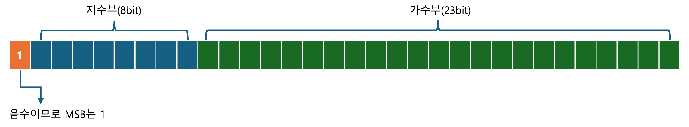
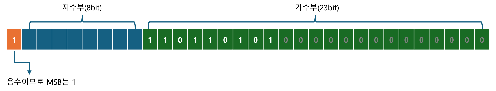
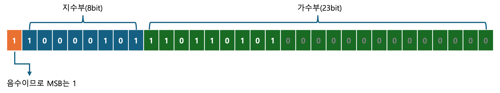

# 데이터 표현 단위

## 비트(bit)와 바이트(Byte)

- `bit` 컴퓨터가 표현하는 데이터의 최소 단위, 2진수 값 하나를 저장할 수 있는 메모리의 크기
- `byte`  8bit = 1byte

## 8진수, 16진수의 표현 방법

```c
int num1=10; // 10진수
int num2=0xA; // 16진수
int num3=012; // 8진수
```

# 정수와 실수의 표현 방식

> C언어는 보통 하나의 정수를 4바이트로 표현(32비트) 합니다. 다만, 여기서는 너무 길어지므로 1바이트로 설명하겠습니다.
> 

정수의 가장 왼쪽에 존재하는 비트는 ‘부호비트’ 즉, `MSB(Most Significant Bit)` 라 부릅니다.

- 이때 양수는 0, 음수는 1을 설정합니다.

## 음의 정수를 표현할 때에는 2의 보수를 취해야 한다.

음의 정수에서 MSB만 1로 설정해 줄 경우 아래의 문제가 발생됩니다.

- 이유 1) MSB를 1로 설정하여 계산할 경우(산술식의 문제)
    
    ```
    정수)  00000101 +5
    음수)  10000101 -5
        +
    ------------------
          10001010 → 이는 '0'이 아니다.
    ```
    
- 이유 2) 0이 두개 존재
    
    ```
    +0 = 00000000
    -0 = 10000000
    ```
    
- 이유 3) 비교연산의 모순
    
    ```
    3 > 2 = 0011 > 0010 = True
    -2 > -3 = 1010 > 1011 = 모순발생
    ```
    

그래서 음의 정수를 표현할 때에는 2의 보수(`1의 보수 → 끝에 +1`)를 취해야 합니다.

```
00000101 +5
11111010 (1의 보수)
11111011 (끝에 +1)

정수)   00000101 +5
음수)   11111011 -5
    +
------------------
			 100000000 → 올림수는 버려져서 0
```

## 실수의 표현 방식

실수를 표현하는 방식은 정수와는 다르게 부동소수점 방식을 사용합니다.

부동 소수점(floating point)방식은 소수점(point)이 둥둥 떠다닌다.(floating)라는 의미로, 가수부와 지수부로 나눕니다.

아래는 `123.4`를 부동소수점 방식으로 표현(`지수(e) 표기법`)한 예제 입니다.

```c
double d2 = 1.234e2; // 1.234 * 10^2 = 123.4
double e1 = 1.7e+3; // 1700.0
double e2 = 1.7e-3; // 0.0017
```

## 부동 소수점 계산 방법

- S(Sign bit) 부호
    - 0이면 양수, 1이면 음수
- E(Exponent) 지수부
    - 부호있는 정수 지수의 범위는 `-127 ~ 128` (float), `-1023 ~ 1024` (double)
- M(Mantissa) 가수부
    - 실제값을 저장하는 부분으로 10진수 7자리(float), 15자리(double)의 정밀도로 저장 가능
- 예제) `-118.625` 부동 소수점 변환 과정
    1. 음수이기에 최상위 비트를 1로 설정
        
        
        
    2. 절대값 `118.625`를 이진법으로 변환
        
        ```
        # 정수부 변환
        118
        = 1110110(2)
        
        # 소수부 변환
        0.625
        = 0.625 x 2 = 1.250 → 정수부 1
        = 0.250 x 2 = 0.500 → 정수부 0
        = 0.500 x 2 = 1.000 → 정수부 1
        = 101(2)
        
        # 결과
        118.625 
        = 1110110.101(2)
        ```
        
    3. 소수점을 이동시켜 정수부가 한자리가 되도록 변환
        
        > 소수점을 이동시키는 것을 정규화(Normalization)
        > 
        
        ```
        1110110.101(2) → 1.110110101 * 2^6
        ```
        
    4. 가수부 비트에 실수값 그대로 넣는다 (점 무시)
        
        
        
    5. 지수에 바이어스 값(127)을 더하고 지수부 비트에 넣는다.
        
        > 32bit IEEE 754 형식에는 bias 라는 고정값(127)이 존재.
        bias를 사용하는 이뉴는 지수가 음수가 될 수 있는 케이스가 있기 때문이다.(`2^10 or 2^-10`)
        예시) 0.000101(2) 이진수
        → 1.xxxx … * 2^n 형식으로 표현하기 위해 `1.01 * 2^-4` 가 된다.
        → -4 음수 지수를 8자리 비트로 표현하기 위해, (10진수를 기준으로) 0~127 구간은 음수, 128~255 구간은 양수를 표현하도록 만든 것
        → 즉, 계산된 지수에 127 bias 값을 더하여, 127보다 작으면 음수, 127보다 크면 양수로 구분
        
        참고로 64bit(배정도)의 경우 bias 고정값은 1023
        > 
        
        ```
        1.110110101 * 2^6 에서 지수가 6이므로
        6 + 127 
        = 133
        = 100000101(2)
        ```
        
        
        

# 연산자

## 연산자의 종류

- **대입 연산자**: `=`
- **산술 연산자**: `+`(덧셈), `-`(뺄셈), `*`(곱셈), `/`(나눗셈), `%`(나머지)
- **복합 대입 연산자**: `*=` `/=` `%=` `+=` `-=` `<<=` `>>=` `&=` `^=` `|=`
- **증감 연산자**: `++num`(전위증가), `num++`(후위증가), `--num`(전위감소), `num--`(후위감소)
- **관계 연산자**: `<` `>` `==` `!=` `<=` `>=`
- **논리 연산자**: `&&` `||` `!`
    
    > C언어에서 0이 아닌 모든 값을 참(True)로 간주
    > 
    > 
    > ```c
    > int main(void)
    > {
    > 	int num = 10; // (2진수 1010)
    > 	printf("%d", !num); // 5(2진수 0101)가 아니라 0이 나온다.
    > }
    > ```
    > 
- **비트 연산자**: `&`(비트 AND), `|`(비트 OR), `^`(비트 XOR), `~`(비트 NOT), `<<`(왼쪽 시프트), `>>`(오른쪽 시프트)

## 연산자 우선순위

- `덧셈`, `뺄셈` 보다는 `곱셈`, `나눗셈`을 먼저 계산
- `곱셈`과 `나눗셈`은 왼쪽에서 먼저 등장하는 것부터 순서대로 계산

## 비트 연산자

### & 연산자: 비트단위 AND

```c
0 & 0 = 0
0 & 1 = 0
1 & 0 = 0
1 & 1 = 1
```

### | 연산자: 비트단위 OR

```c
0 | 0 = 0
0 | 1 = 1
1 | 0 = 1
1 | 1 = 1
```

### ^ 연산자: 비트단위 XOR

```c
0 ^ 0 = 0
0 ^ 1 = 1
1 ^ 0 = 1
1 ^ 1 = 0
```

### ~ 연산자: 비트단위 NOT

```c
~0 = 1
~1 = 0
```

### << 연산자: 비트의 왼쪽 이동(Shift)

```c
num1 << num2 // num1의 비트 열을 num2칸씩 왼쪽으로 이동시킨 결과를 반환
8 << 2 // 00001000 → 00100000 = 32
```

- 1칸씩 이동시킬 때마다 정수의 값은 두 배가 된다.
    - 8 곱하기 2칸(2^2 = 4)  = 8 x 4 = 32

### >> 연산자: 비트의 오른쪽 이동(Shift)

```c
num1 > num2 // num1의 비트 열을 num2칸씩 왼쪽으로 이동시킨 결과를 반환
8 >> 2 // 00001000 → 00000010 = 2
```

- 1칸씩 이동시킬 때마다 정수의 값은 2로 나누어진다.
    - 8 나누기 2칸(2^2) = 8 / 4 = 2
- 단, num1이 음수라면? → CPU에 따라 달라짐 → CPU 마다 0또는1을 채움
    
    ```c
    -16에 해당하는 비트열을 >> 연산을 통해 2칸씩 오른쪽 이동할 경우
    1111111 1111111 11111111 11110000 // -16
    1) 00111111 11111111 11111111 11111100 // 0이 이 채워진 경우
    2) 11111111 11111111 11111111 11111100 // 1이 채워진 경우
    ```
    
    - 나는 -4가 나온다. → 2번 결과

# 예제 출력

```bash
$ gcc -o operator.o operator.c
$ ./operator.o
[*] 데이터 표현 단위 - 8진수, 16진수의 표현 방법
16진수 0xA를 10진수로 변경: 10
 8진수 012를 10진수로 변경: 10

[*] 데이터 표현 단위 - 실수의 표현 방식
1.234e2 -> 123.4
1.7e+3 -> 1700
1.7e-3 -> 0.0017

[*] 연산자의 종류
>> [대입 연산자] num1 = 10
>> [산술 연산자] num2 = num1 + 5 = 15
>> [복합 대입 연산자] num2 += num1 = 25
>> [증감 연산자] num1++ = 11
>> [관계 연산자] num1 <= num2
>> [논리 && ] 1 && 0= 0
>> [논리 || ] 1 || 0 = 1
>> [논리 !  ] !10 = 0
>> [비트 &  ] 11 & 25 = 9
>> [비트 |  ] 11 | 25 = 27
>> [비트 ^  ] 11 ^ 25 = 18
>> [비트 ~  ] ~0 = -1
>> [비트 ~  ] ~1 = -2
>> [비트 << ] 8 << 2 = 32
>> [비트 >> ] 8 >> 2 = 2
```